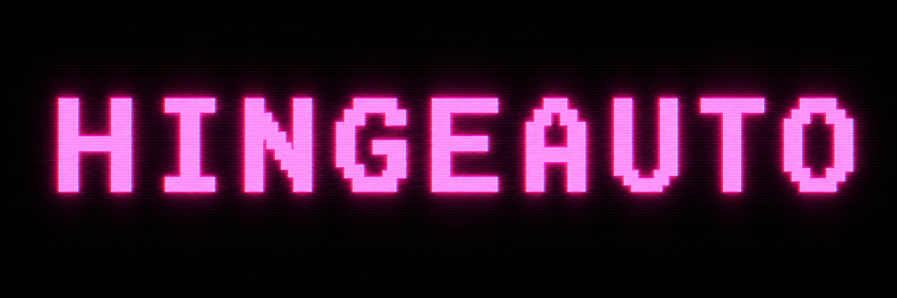

<!-- Hero: CRT "HINGEAUTO" wordmark — see docs/assets/README.md for the image-gen prompt. -->
<p align="center">
  
</p>

<p align="center">
  <strong>An LLM that swipes Hinge for you.</strong><br/>
  A stitched-vision + LLM-judge loop that drives a real Hinge install on an Android emulator — it reads each profile, judges it against <em>your</em> rubric, and skips or likes with a personalized opener.
</p>

<p align="center">
  <a href="LICENSE"></a>
  
  
  
  <a href="#-read-this-first"></a>
</p>

<p align="center">
  <a href="#-read-this-first">Read this first</a> ·
  <a href="#quickstart">Quickstart</a> ·
  <a href="#writing-your-own-mode">Modes</a> ·
  <a href="#backends-anthropic-api-vs-ollama-free">Backends</a> ·
  <a href="#architecture">Architecture</a> ·
  <a href="LICENSE">License</a>
</p>

<p align="center">
  <sub>brought to you by</sub><br/>
  <a href="https://github.com/TerraByte-Dev"></a>
</p>

---

HingeAuto is what you get when you point a vision-LLM at a phone screen and let
it date for you. An Android emulator runs a real Hinge install; this repo drives
it over ADB, judging every profile against a rubric **you** write and acting on
the verdict — skip, or like with a personalized opener. It runs on **Claude** out
of the box, or completely free on a local **Ollama** model. The fun part is the
AI engineering — stitched-frame vision plus a forced structured decision; the
swiping is just the demo.

## ⚠ Read this first

**This project automates Hinge, which violates Hinge's Terms of Service.**
Real risk of account ban with no appeal. Treat this as an educational toy
for a single throwaway account, not a dating strategy.

- **One account only.** The shipped default `MAX_LIKES_PER_SESSION = 8`
  matches free Hinge's daily like cap (resets at 4am local). One session
  per day exhausts the free allotment.
- **Get Hinge+ if you're going to use this seriously.** It removes the
  daily like cap, and this repo is basically the most efficient way to
  use the subscription — the bot does the liking for you, so you get full
  value without ever opening the app. With Hinge+, bump
  `MAX_LIKES_PER_SESSION` to 25–50 and run multiple sessions across the day.
- **No warranty. No support.** Your account, your problem.
- The repo exists because automating a stitched-vision + LLM-judge loop on
  a phone UI is an interesting AI engineering exercise — not because anyone
  thinks bot-swiping is good dating advice.

## What it does

Drives an Android emulator running Hinge through ADB. For each profile it
scrolls top-to-bottom, screenshots the frames, asks Claude (or a local
Ollama model) to judge against a user-defined rubric, and either taps Skip
or taps the heart and types a personalized opener.

<p align="center">
  
</p>
<p align="center">
  <sub><b>The loop</b> — capture a profile across ~7 frames → stitch → an LLM judges it against your rubric → <b>skip</b>, or <b>like</b> with a written opener. The interesting part is the AI engineering; the swiping is just the demo.</sub>
</p>

> ### 🤖 Tip: open this repo in Claude Code or Codex
>
> This repo ships with [`AGENTS.md`](./AGENTS.md) (and [`CLAUDE.md`](./CLAUDE.md)).
> If you cloned this and you're not sure where to start, open the directory
> in Claude Code, Codex CLI, Cursor, or any agent that respects `AGENTS.md`
> and say _"help me set this up."_ The agent will walk you through emulator
> config, calibration, writing a rubric, and the first live run.
>
> If you'd rather do it manually, read on.

## Quickstart

### 1. Set up Android Studio + a Pixel 10 emulator

If you've never used Android Studio, this is the longest step. Skip ahead
if you already have an emulator running with `adb devices` showing it.

1. Download Android Studio from <https://developer.android.com/studio>
   (free, ~1 GB). During install, keep "Android SDK" and "Android Virtual
   Device" checked — they bundle the `adb` CLI this repo needs.
2. Open Android Studio. On the Welcome screen click **More Actions →
   Virtual Device Manager** (or **Tools → Device Manager** if you've
   already opened a project).
3. Click **+ Create Device** (or the **+** icon).
4. Under **Phone**, select **Pixel 10**. If your Android Studio version
   doesn't list Pixel 10 yet, **Pixel 9** has the same 1080×2424 screen
   and works identically. Click **Next**.
5. Pick a system image. **API 34 (Android 14) with Google Play** is a good
   default — Hinge installs cleanly from the Play Store on it. Download the
   image if there's a download icon next to it (~1 GB, one-time). Click
   **Next → Finish**.
6. Back in Device Manager, click the **▶ play** arrow on the new device
   row. First boot takes 2–5 minutes.
7. In the emulator, open **Play Store**, sign in with a throwaway Google
   account, search **Hinge**, install, open, finish onboarding (one account
   only — see [Read this first](#-read-this-first)), navigate to the
   **Discover** tab.

**Cold Boot when things get weird.** The emulator persists state via
snapshots ("Quick Boot"), so a borked Hinge state or hung input can survive
restarts. To wipe the snapshot: in Device Manager, click the **⋮** menu on
the device row → **Cold Boot Now**. This is the emulator-equivalent of
yanking the battery.

**Confirm `adb` works.** From a fresh terminal:

```
adb devices
```

You should see `emulator-5554   device` (or similar). If `adb` isn't on
your PATH, find it under your Android SDK directory (on Windows:
`%LOCALAPPDATA%\Android\Sdk\platform-tools\`; on Mac:
`~/Library/Android/sdk/platform-tools/`) and add that to PATH.

### 2. Install repo dependencies

```
git clone https://github.com/TerraByte-Dev/hinge-auto.git
cd hinge-auto
pip install -r requirements.txt
```

### 3. Pick a judge backend

```
cp .env.example .env
```

Then either:

- **Anthropic (default, best quality)** — open `.env` and add
  `ANTHROPIC_API_KEY=sk-ant-...`. Get a key at
  <https://console.anthropic.com>. Roughly $0.25/day at the free-tier cap.
- **Ollama (free)** — see the [Backends](#backends-anthropic-api-vs-ollama-free)
  section below. Lower decision quality, no per-token cost.

### 4. Calibrate coordinates (probably skip)

The shipped `config.COORDS` is tuned for a Pixel 10 emulator at 1080×2424.
If that's what you set up, you can skip this step.

For other devices or after a Hinge UI update, run:

```
python calibrate.py
```

It saves `calibrate.png` to the repo root. Open it in any image viewer that
shows cursor coordinates (Paint, IrfanView, Preview's inspector) and update
the values in `config.COORDS` that don't match.

### 5. Pick a mode

Three example modes ship in `modes/` (see [Writing your own mode](#writing-your-own-mode)).
Set `ACTIVE_MODE` in `config.py` to the file's `NAME` field. The shipped
`MAX_LIKES_PER_SESSION = 8` matches free Hinge's daily cap — leave it for
your first run.

### 6. Run

With Hinge open on the Discover tab in the emulator:

```
python main.py
```

Watch the first few decisions print live. If a decision or opener looks
wrong: Ctrl-C, edit `PREFERENCES` in your mode file, re-run. With Hinge+,
bump `MAX_LIKES_PER_SESSION` to 25–50 once decisions consistently match
your rubric.

> **Free tier?** Set `DRY_RUN = True` in `config.py` for the first run or
> two. It runs the judge without spending likes (every would-like is
> force-skipped instead), so your 8/day cap survives a rubric you haven't
> tuned yet. With Hinge+ (unlimited likes), skip dry-run — small live
> batches are a faster feedback loop.

## Bonus: scan your own profile

```
python scan_self.py
```

Taps through to your own profile's "View" tab (what other people see),
captures the frames, sends them to Claude, and writes a Markdown report to
`debug/self_scan_<timestamp>.md` with specific suggestions for photos,
prompts, and the overall hook. Run it once a week.

This is the one thing in this repo that **doesn't violate Hinge's ToS** —
no swiping, no messaging, just looking at your own content. Probably the
most useful tool in the repo.

## Writing your own mode

Three example rubrics ship in `modes/`:

- `example_lenient.py` — default-LIKE, generic. Good starting point.
- `example_strict.py` — default-SKIP, generic. The antonym.
- `cougar.py` — themed: older age band (33–44) with playful young-buck
  premades. Shows how to combine `AGE_MIN/MAX`, an inline `MESSAGE_VOICE`,
  and themed `PREMADES`. The mode behind the framing that got the project
  some attention. Run it with `python main.py --mode cougar --set-filters`
  to also drive Hinge's in-app age slider.

To write your own:

1. Copy `modes/template.py.example` to `modes/<your_name>.py`.
2. Edit `PREFERENCES` to describe what should and shouldn't get a like.
3. Optionally set `MESSAGE_VOICE` to one of the templates under `voice/`
   (e.g. `"example_casual"` or `"example_polished"`), or paste a multi-line
   rubric string directly into the field.
4. Optionally populate `PREMADES` with verbatim openers Claude can pick from
   instead of writing fresh copy.
5. Point `ACTIVE_MODE` in `config.py` at the new file (use the value of its
   `NAME` field, not the filename), or pass `--mode <your_name>` on the
   command line.

### Calibration (the optional extras)

`python calibrate.py` (covered in [Quickstart](#4-calibrate-coordinates-probably-skip))
handles the main coords. Two more calibration scripts are only needed if you
use the corresponding optional features:

- `python calibrate_filters.py` — Age slider thumb anchors. Needed for
  `python main.py --set-filters`.
- `python calibrate_matches.py` — Matches-tab tap target. Needed for
  `python matches_scan.py`.

The location picker (`locations.py`) needs a hand-rolled
`location_coords.json`. A schema is at `location_coords.json.example` — copy
it, rename, fill in pixel coords from a `calibrate.py` screenshot. (No
interactive helper exists for this one yet; PRs welcome.)

## Architecture

```
ADB capture  →  frame stitching  →  Claude judge  →  action
   adb.py        config / main         judge.py       main.py
                                       vision.py      adb.py
```

- **`adb.py`** wraps the `adb` CLI: screenshot, tap, swipe, type.
- **`main.py`** is the loop. For each profile: scroll-to-top, capture N
  frames, run them through the active backend's `judge()`, then either skip
  or scroll back, tap the heart, type the opener, and tap Send Like.
- **`judge_common.py`** holds the backend-agnostic pieces: system prompt
  template, JSON tool schema, `Decision` dataclass, voice resolver, and the
  `load_backend()` dispatcher.
- **`judge.py`** is the Anthropic backend — Claude vision + forced tool
  call. Caches the system prompt to keep cost down.
- **`judge_ollama.py`** is the Ollama backend (Cloud or local).
- **`vision.py`** finds UI elements whose absolute position shifts
  per-profile (heart icon on photo 1, Send Like button, comment input).
  Pixel-level detection, not OCR.
- **`modes/`** holds rubric files. `config._apply_mode()` copies the active
  mode's `PREFERENCES`, `AGE_MIN/MAX`, `MESSAGE_VOICE`, and `PREMADES` onto
  the `config` module so the rest of the code reads them via `config.<name>`.
- **`voice/`** holds opener-tone templates that modes can reference by name.
- **`metrics.py`** appends one JSONL record per profile to
  `debug/session_log.jsonl` for after-the-fact analysis.
- **`filters.py` / `locations.py`** drive Hinge's in-app filter sheets
  (age, neighborhood). Both need calibrated coord files.
- **`matches_scan.py`** scrapes the Matches tab via a separate Claude vision
  pass — for analytics, not for the swipe loop.
- **`scan_self.py`** captures the user's own profile (via the "View" tab)
  and asks Claude for improvement suggestions. The non-swiping feature of
  the repo; nothing here violates Hinge ToS.

## Safety and rate limits

- `MAX_LIKES_PER_SESSION = 8` is the shipped default — matches free Hinge's
  daily cap (resets 4am local). One session per day exhausts the free
  allotment.
- **Get Hinge+** if you're going to use this seriously. Without it the daily
  cap makes the tool pointless. With it, the bot becomes the most efficient
  way to use the subscription — you get the full like allotment without ever
  opening the app. With Hinge+, raise the cap to 25–50 per session and
  spread batches across the day. One giant batch tends to trip Hinge's
  soft-throttle (empty Discover).
- Don't change locations more than ~2 times per day. Frequent MyMove changes
  get throttled.
- One account. Don't run this on your real Hinge account.
- Anthropic API spend at the free-tier cap is negligible (~$0.25/day on
  Sonnet at 8 likes + skipped profiles). Watch the running totals printed
  each loop if you raise the cap.

## Backends: Anthropic API vs Ollama (free)

The judge pipeline ships with two interchangeable backends. Pick via
`JUDGE_BACKEND` in `config.py`. Both backends share the same system prompt,
schema, and `Decision` shape (in `judge_common.py`) — only the API call
differs.

### `"anthropic"` (default, recommended)

Uses Claude with vision + forced tool calling. Best quality decisions and
best opener writing. Roughly **$0.02–$0.05 per profile** on Sonnet at medium
effort.

Setup:
1. `pip install -r requirements.txt`
2. Put `ANTHROPIC_API_KEY=...` in `.env`.
3. Leave `JUDGE_BACKEND = "anthropic"` in `config.py`.

### `"ollama"` (free — Ollama Cloud or local)

Uses an open-weight vision model through Ollama. **No per-token cost** on the
free tier of Ollama Cloud, or fully local on your own GPU.

Setup:
1. Install the extra dep:
   ```
   pip install -r requirements.txt
   pip install -r requirements-ollama.txt
   ```
2. Either:
   - **Ollama Cloud** — sign up at <https://ollama.com>, create an API key,
     set `OLLAMA_API_KEY=...` in your `.env`, and set
     `OLLAMA_HOST = "https://ollama.com"` in `config.py`.
   - **Local Ollama** — install Ollama, `ollama pull qwen2.5-vl`, run
     `ollama serve`. Leave `OLLAMA_HOST = None` (defaults to
     `http://localhost:11434`).
3. Set `JUDGE_BACKEND = "ollama"` in `config.py`.

Honest tradeoffs:
- **Decision quality** on a 7-screenshot judgment is meaningfully worse than
  Sonnet — expect more wrong skips on good profiles and more generic openers.
- **Tool-calling reliability** varies by model. `qwen2.5-vl` is the best of
  the open-weight options as of this writing. If you see `RuntimeError:
  Ollama (...) did not return a usable submit_decision call`, try a larger
  variant (`qwen2.5-vl:32b`) or switch to `llama3.2-vision`.
- The `matches_scan.py` analytics scrape still uses Anthropic — it's a
  separate tool, not the swipe loop, and the swap there isn't wired up.

## License

MIT. See [`LICENSE`](LICENSE).

## Contributing

This is a personal project published as-is. PRs that strip more PII, fix
calibration on additional devices, or add a real `calibrate_locations.py`
are welcome. PRs that improve evasion of Hinge's bot-detection are not.

<p align="center">
  <a href="https://github.com/TerraByte-Dev"></a><br/>
  <sub>An open-source project by <strong>TerraByte Solutions LLC</strong></sub>
</p>
